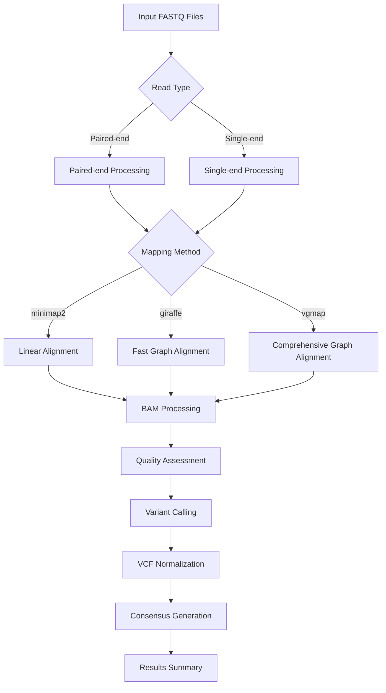

# LSDV (Lumpy Skin Disease Virus) Integrated Variant Calling Pipeline

[](https://opensource.org/licenses/MIT)
[](https://github.com/your-org/lsdv-pipeline)
[](https://github.com/your-org/lsdv-pipeline/releases)

## Overview

The LSDV Integrated Variant Calling Pipeline is a comprehensive bioinformatics workflow designed for analyzing Lumpy Skin Disease Virus (LSDV) sequencing data. This pipeline supports three different read mapping approaches and multiple reference genome configurations, providing researchers with flexible options for variant discovery and genomic analysis.

### Key Features

- **Three Mapping Methods**: Minimap2 (linear), VG Giraffe (fast graph-based), and VG Map (comprehensive graph-based)
- **Multiple Reference Genomes**: Support for 1, 3, 6, or 121 genome references  
- **Comprehensive Variant Calling**: Integration of VG, FreeBayes, and BCFtools variant callers
- **Quality Control**: Built-in quality assessment with Qualimap and coverage analysis
- **Organized Output**: Method and reference-specific directory structure
- **SLURM Integration**: Ready-to-use batch submission commands
- **Robust Error Handling**: Comprehensive logging and validation

## Table of Contents

- [Installation](#installation)
- [Quick Start](#quick-start)
- [Pipeline Architecture](#pipeline-architecture)
- [Usage](#usage)
- [Reference Genome Setup](#reference-genome-setup)
- [Output Structure](#output-structure)
- [Variant Calling Methods](#variant-calling-methods)
- [Batch Processing](#batch-processing)
- [Troubleshooting](#troubleshooting)
- [Performance Considerations](#performance-considerations)
- [Contributing](#contributing)
- [Citation](#citation)

## Installation

### Prerequisites

The pipeline requires the following software tools:

#### Essential Tools
- **vg toolkit** (≥1.40.0) - For graph-based genomics
- **minimap2** (≥2.24) - For linear read alignment
- **samtools** (≥1.9) - For BAM file processing
- **bcftools** (≥1.15) - For variant calling and processing
- **bgzip/tabix** - For VCF compression and indexing
- **freebayes** (≥1.3) - For variant calling

#### Optional Tools
- **qualimap** (≥2.2.1) - For quality assessment
- **pggb** - For pangenome graph construction
- **fastp** - For read preprocessing

#### System Requirements
- Linux-based system (tested on CentOS 7+, Ubuntu 18.04+)
- Minimum 16GB RAM (50GB+ recommended for 121-genome reference)
- 20+ CPU cores recommended for optimal performance
- Sufficient storage space (varies by dataset size)

### Installation Steps

1. **Clone the repository:**
```bash
git clone https://github.com/your-org/lsdv-pipeline.git
cd lsdv-pipeline
```

2. **Make the pipeline executable:**
```bash
chmod +x lsdv_integrated_pipeline.sh
```

3. **Install dependencies:**
```bash
# Install via conda (recommended)
conda env create -f environment.yml
conda activate lsdv-pipeline

# Or install manually following each tool's documentation
```

4. **Set up reference genomes** (see [Reference Genome Setup](#reference-genome-setup))

## Quick Start

### Basic Usage

```bash
# Single genome reference with VG Giraffe
./lsdv_integrated_pipeline.sh SRR11470182 1 giraffe

# 3-genome reference with Minimap2
./lsdv_integrated_pipeline.sh SRR10394925 3 minimap2

# 121-genome reference with VG Map
./lsdv_integrated_pipeline.sh SRR12345678 121 vgmap
```

### Input File Requirements

The pipeline expects preprocessed, quality-trimmed FASTQ files in the following location:
```
/mnt/lustre/RDS-archive/downing/LSDV/KRAKEN_VALID_FILES/
```

File naming convention:
- **Paired-end**: `{SAMPLE}_1_trim_fastp.fastq` and `{SAMPLE}_2_trim_fastp.fastq`
- **Single-end**: `{SAMPLE}_trim_fastp.fastq`

## Pipeline Architecture

### Workflow Overview



### Processing Steps

1. **Parameter Validation**: Validate input parameters and file availability
2. **Directory Setup**: Create method and reference-specific output directories
3. **Read Mapping**: Perform alignment using selected method
4. **BAM Processing**: Sort, deduplicate, and index alignments
5. **Quality Control**: Generate coverage and quality metrics
6. **Variant Calling**: Call variants using multiple approaches
7. **Normalization**: Normalize and index VCF files
8. **Consensus Generation**: Create consensus sequences
9. **Summary Generation**: Compile results and statistics

## Usage

### Command Syntax

```bash
./lsdv_integrated_pipeline.sh <sample_name> <reference_type> <mapping_method>
```

### Parameters

| Parameter | Type | Options | Description |
|-----------|------|---------|-------------|
| `sample_name` | String | Any valid sample ID | Sample identifier (e.g., SRR11470182) |
| `reference_type` | Integer | 1, 3, 6, 121 | Number of reference genomes to use |
| `mapping_method` | String | minimap2, giraffe, vgmap | Read alignment method |

### Reference Types Explained

- **1 genome**: Single reference genome (fastest, traditional approach)
- **3 genomes**: Three representative genomes (balanced speed/accuracy)
- **6 genomes**: Six diverse genomes (enhanced variant detection)
- **121 genomes**: Full pangenome (most comprehensive, resource-intensive)

### Mapping Methods Compared

| Method | Speed | Memory | Sensitivity | Best Use Case |
|--------|-------|--------|-------------|---------------|
| **minimap2** | Fastest | Low | Standard | Quick analysis, large datasets |
| **giraffe** | Fast | Medium | High | Balanced performance |
| **vgmap** | Slower | High | Highest | Maximum sensitivity |

## Reference Genome Setup

### Graph Construction Commands

The pipeline includes commented sections for building graph indices. Uncomment and run these **once per reference type**:

#### For 1 Genome Reference
```bash
# Only requires FASTA indexing for minimap2
samtools faidx 1genomes.fasta
```

#### For 3 Genome Reference
```bash
# Build pangenome graph
pggb -i 3genomes.fasta -m -S -o LSDV3 -t 36 -p 90 -s 1k -n 3

# Convert to VG format
vg convert -t 12 -g LSDV3.gfa -v > LSDV3.vg
vg autoindex -p LSDV3 -g LSDV3.gfa -t 22
samtools faidx 3genomes.fasta
vg convert LSDV3.xg -p > LSDV3.pg
vg snarls LSDV3.pg > LSDV3.snarls
vg index -j LSDV3.dist -s LSDV3.snarls LSDV3.xg

# Additional indices for Giraffe
vg gbwt --gbz-format -g LSDV3.gbz -G LSDV3.gfa
vg gbwt -o LSDV3.gbwt -Z LSDV3.gbz
vg convert -x --drop-haplotypes LSDV3.gbz > LSDV3.xg
vg minimizer LSDV3.gbz -d LSDV3.dist -o LSDV3.min
```

#### For 6 and 121 Genome References
Similar commands with appropriate parameters (see pipeline comments for details).

### File Organization

Reference files should be placed in the pipeline root directory:
```
lsdv-pipeline/
├── 1genomes.fasta
├── 3genomes.fasta
├── 6genomes.fasta
├── LSDV_genomes.fasta
├── LSDV1.xg, LSDV1.gcsa, etc.
├── LSDV3.xg, LSDV3.gcsa, etc.
└── ... (other index files)
```

## Output Structure

The pipeline creates method and reference-specific output directories:

```
MINIMAP2_1GENOME/          # Minimap2 with 1 genome
├── SAM_FILES/             # Alignment files (SAM format)
├── BAM_FILES/             # Processed alignments
├── FB_VCF_FILES/          # FreeBayes variant calls
├── BCF_VCF_FILES/         # BCFtools variant calls
├── CONSENSUS/             # Consensus sequences
├── COVERAGE/              # Coverage statistics
├── QUALIMAP/              # Quality reports
├── ERROR_FILES/           # Error logs
└── STATS/                 # Summary statistics

GIRAFFE_3GENOME/           # VG Giraffe with 3 genomes
├── GAM_FILES/             # Graph alignment files
├── BAM_FILES/             # BAM alignments
├── VG_VCF_FILES/          # VG variant calls
├── FB_VCF_FILES/          # FreeBayes variant calls
├── BCF_VCF_FILES/         # BCFtools variant calls
├── AUG/                   # Augmented graphs
├── PACK_FILES/            # Pileup data
├── DEPTH_FILES/           # Depth information
└── ... (other directories)

VGMAP_121GENOME/           # VG Map with 121 genomes
└── ... (similar structure)
```

### Key Output Files

For each sample, the pipeline generates:

| File Type | Location | Description |
|-----------|----------|-------------|
| Final BAM | `BAM_FILES/{sample}.rmdup.sorted.bam` | Processed, deduplicated alignments |
| VG Variants | `VG_VCF_FILES/{sample}.norm.vg.vcf.gz` | Graph-based variant calls |
| FreeBayes Variants | `FB_VCF_FILES/{sample}.norm.fb.vcf.gz` | FreeBayes variant calls |
| BCFtools Variants | `BCF_VCF_FILES/{sample}.norm.bcf.vcf.gz` | BCFtools variant calls |
| Coverage Stats | `COVERAGE/{sample}.coverage.txt` | Coverage statistics |
| Quality Report | `QUALIMAP/{sample}/` | Detailed quality metrics |
| Consensus Ref | `CONSENSUS/{sample}.LA.fasta` | Reference allele consensus |
| Consensus Alt | `CONSENSUS/{sample}.LR.fasta` | Alternate allele consensus |
| Summary | `STATS/{sample}_summary.txt` | Pipeline summary |

## Variant Calling Methods

### VG (Graph-based)
- **Availability**: Only with `giraffe` and `vgmap` methods
- **Approach**: Graph-augmented variant calling
- **Strengths**: Handles complex structural variants, population-aware
- **Best for**: Comprehensive variant discovery in diverse populations

### FreeBayes
- **Availability**: All mapping methods
- **Approach**: Bayesian genetic variant detector
- **Strengths**: Good sensitivity for SNPs and small indels
- **Best for**: Standard variant discovery workflows

### BCFtools
- **Availability**: All mapping methods  
- **Approach**: Samtools mpileup + bcftools call
- **Strengths**: Fast, reliable for high-coverage data
- **Best for**: Quick variant calling, consensus generation

### Variant Normalization

All VCF files are normalized using `bcftools norm`:
- Left-alignment of indels
- Splitting of multiallelic sites
- Consistent representation

## Batch Processing

### SLURM Integration

The pipeline includes ready-to-use SLURM submission commands:

#### Process all samples with different methods:

```bash
# All samples with Giraffe mapping to 3 genomes
more acc_list.txt | perl -e 'while(<>){ chomp; print "sbatch -c 20 --mem=50G -J $_.giraffe.job lsdv_integrated_pipeline.sh $_ 3 giraffe\n"; }'

# All samples with Minimap2 mapping to single genome  
more acc_list.txt | perl -e 'while(<>){ chomp; print "sbatch -c 20 --mem=50G -J $_.minimap2.job lsdv_integrated_pipeline.sh $_ 1 minimap2\n"; }'

# All samples with VG Map to 121 genomes (high memory)
more acc_list.txt | perl -e 'while(<>){ chomp; print "sbatch -c 40 --mem=250G -J $_.vgmap.job lsdv_integrated_pipeline.sh $_ 121 vgmap\n"; }'
```

#### Method comparison for single sample:
```bash
SAMPLE="SRR11470182"
for METHOD in minimap2 giraffe vgmap; do
    for REF in 1 3 6 121; do
        sbatch -c 20 --mem=50G -J ${SAMPLE}.${METHOD}.${REF}g.job \
            lsdv_integrated_pipeline.sh $SAMPLE $REF $METHOD
    done
done
```

### Resource Requirements by Configuration

| Reference | Method | CPUs | Memory | Time (est.) |
|-----------|--------|------|---------|-------------|
| 1 genome | minimap2 | 20 | 16GB | 30-60 min |
| 1 genome | giraffe | 20 | 32GB | 45-90 min |
| 3 genomes | giraffe | 20 | 50GB | 60-120 min |
| 6 genomes | giraffe | 20 | 64GB | 90-180 min |
| 121 genomes | vgmap | 40 | 250GB | 4-8 hours |

## Troubleshooting

### Common Issues

#### 1. Input Files Not Found
```
Error: No valid input files found for sample SRRXXXXXX
```
**Solution**: Verify input files exist in the expected location and follow naming convention.

#### 2. Memory Issues
```
Error: Job killed due to memory limit
```
**Solution**: Increase memory allocation, especially for 121-genome reference:
```bash
sbatch -c 40 --mem=250G ...  # For 121 genomes
```

#### 3. Graph Index Missing
```
Error: Could not open LSDV3.xg
```
**Solution**: Build graph indices first (see [Reference Genome Setup](#reference-genome-setup)).

#### 4. VG Tools Not Found
```
Command 'vg' not found
```
**Solution**: Install VG toolkit and ensure it's in PATH:
```bash
# Check VG installation
which vg
vg version

# If not installed, use conda:
conda install -c bioconda vg
```

### Debug Mode

Enable verbose logging by modifying the script:
```bash
# Add at the top of the script
set -x  # Enable debug mode
set -e  # Exit on error
```

### Log Files

Check error logs in the `ERROR_FILES/` directory:
- `{sample}.sam.errors.txt` - Mapping errors
- `{sample}.vg.errors.txt` - VG variant calling errors  
- `{sample}.fb.errors.txt` - FreeBayes errors
- `{sample}.cov.errors.txt` - Coverage calculation errors

## Performance Considerations

### Optimization Tips

1. **Choose appropriate reference size**:
   - Use 1 genome for quick analysis
   - Use 3-6 genomes for balanced performance
   - Use 121 genomes only when maximum sensitivity is required

2. **Select optimal mapping method**:
   - `minimap2`: Fastest, good for large datasets
   - `giraffe`: Best balance of speed and accuracy
   - `vgmap`: Most comprehensive but slowest

3. **Resource allocation**:
   - Scale CPU and memory based on reference size
   - Use SSDs for temporary files when possible
   - Consider I/O bottlenecks for large datasets

4. **Batch processing**:
   - Process samples in parallel when resources allow
   - Use job arrays for large sample sets
   - Monitor resource usage with `squeue` and `sstat`

### Storage Requirements

Approximate storage per sample:

| Reference | Method | Temp Files | Final Output |
|-----------|--------|------------|--------------|
| 1 genome | minimap2 | 2-5 GB | 500 MB |
| 3 genomes | giraffe | 5-10 GB | 1-2 GB |
| 121 genomes | vgmap | 20-50 GB | 5-10 GB |

### Cleanup Recommendations

The pipeline automatically removes intermediate files, but consider:
- Archiving old results periodically
- Using scratch space for temporary files
- Implementing automated cleanup scripts

## Advanced Usage

### Custom Reference Genomes

To use custom reference genomes:

1. **Prepare FASTA files**:
```bash
# Ensure proper naming
mv your_genome.fasta 1genomes.fasta
samtools faidx 1genomes.fasta
```

2. **Build graph indices** (for graph methods):
```bash
# Follow the graph construction commands in the pipeline
```

3. **Update pipeline configuration** if needed

### Integrating with Other Pipelines

The pipeline outputs standard formats (BAM, VCF) compatible with:
- Variant annotation tools (SnpEff, VEP)
- Population genetics software (PLINK, VCFtools)
- Phylogenetic analysis tools (IQ-TREE, RAxML)

### Custom Variant Filtering

Post-process VCF files with custom filters:
```bash
# Example: Filter by quality and depth
bcftools filter -e 'QUAL<30 || DP<10' input.vcf.gz > filtered.vcf
```

## Best Practices

### Data Management
- Maintain consistent sample naming conventions
- Document processing parameters for reproducibility
- Backup critical results and intermediate files
- Use version control for analysis scripts

### Quality Control
- Always review Qualimap reports
- Check mapping statistics in GAM files
- Validate consensus sequences
- Compare results across different methods

### Reproducibility  
- Record software versions used
- Document reference genome sources
- Save parameter files and run logs
- Use containerization when possible

## Contributing

We welcome contributions to improve the LSDV pipeline! Please:

1. Fork the repository
2. Create a feature branch
3. Make your changes with appropriate tests
4. Update documentation as needed
5. Submit a pull request

### Development Guidelines
- Follow bash scripting best practices
- Include error handling and logging
- Update this README for new features
- Test changes with different configurations

### Reporting Issues
- Use GitHub Issues for bug reports
- Include sample data and error logs when possible
- Specify software versions and system configuration

## Citation

If you use this pipeline in your research, please cite:

```
LSDV Integrated Variant Calling Pipeline
[Your Name et al.]
GitHub repository: https://github.com/your-org/lsdv-pipeline
Version: 1.0.0
```

Also cite the underlying tools:
- **VG**: Garrison et al. (2018) Nature Biotechnology
- **Minimap2**: Li (2018) Bioinformatics  
- **FreeBayes**: Garrison & Marth (2012) arXiv
- **BCFtools**: Danecek et al. (2021) GigaScience
- **SAMtools**: Li et al. (2009) Bioinformatics

## License

This project is licensed under the MIT License - see the [LICENSE](LICENSE) file for details.

## Support

For support and questions:
- Create an issue on GitHub
- Contact the development team
- Check the troubleshooting section above

## Changelog

### Version 1.0.0 (Current)
- Initial integrated pipeline release
- Support for three mapping methods
- Multiple reference genome configurations
- Comprehensive variant calling workflow
- SLURM integration and batch processing
- Quality control and consensus generation

---

**Last Updated**: December 2024  
**Pipeline Version**: 1.0.0  
**Compatibility**: Linux systems with standard bioinformatics tools
